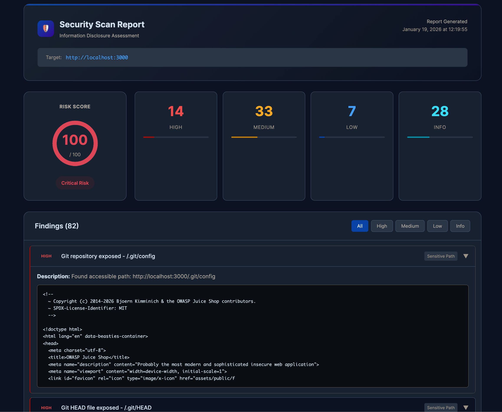

# Info Disclosure Scanner

An AI-powered security scanner that detects sensitive information leakage in web applications using Claude AI.




## Features

- **AI-Powered Analysis** - Uses Claude AI to identify information disclosure vulnerabilities
- **Comprehensive Scanning** - Checks 50+ sensitive paths, headers, JavaScript files, and error responses
- **Beautiful Reports** - Generate HTML reports with risk scores and detailed findings

## Quick Start

```bash
# Clone and setup
git clone https://github.com/Nancy-Chauhan/info-disclosure-scanner.git
cd info-disclosure-scanner
python -m venv venv && source venv/bin/activate
pip install -r requirements.txt

# Add your Anthropic API key
echo "ANTHROPIC_API_KEY=your-key-here" > .env

# Run a scan
python scanner.py https://target.com --html report.html
```

## Demo with OWASP Juice Shop

```bash
# Start the vulnerable test application
docker run -d -p 3000:3000 --name juice-shop bkimminich/juice-shop

# Scan it (finds 80+ vulnerabilities)
python scanner.py http://localhost:3000 --html report.html
```

## What It Detects

| Severity | Examples |
|----------|----------|
| **High** | Exposed `.git` repos, `.env` files, database dumps, hardcoded passwords |
| **Medium** | Admin panels, stack traces, secrets in JavaScript, debug endpoints |
| **Low** | Server version disclosure, robots.txt, technology fingerprinting |
| **Info** | Missing security headers (CSP, HSTS, X-Frame-Options) |

## Usage

```bash
python scanner.py <target> [options]

Options:
  --html FILE      Generate HTML report
  -o FILE          Generate Markdown report
  --json           Output as JSON
  -v               Verbose output
  -w WORDLIST      Enable directory fuzzing with ffuf
```

## License

MIT License - see [LICENSE](LICENSE) for details.
